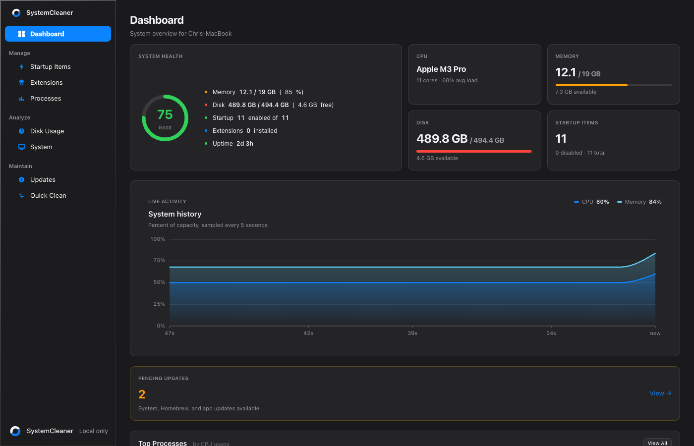

# SystemCleaner

A macOS system cleaner and performance manager that runs entirely on your Mac.

It finds what is filling your disk, removes what is safe to remove, and tells
you the truth about the difference. Nothing is uploaded, no account is required,
and every destructive action is reviewable before it happens.



## What it does

| | |
|---|---|
| **Dashboard** | A health score from live CPU, memory, thermal, disk and I/O signals, with the top processes and what needs attention. |
| **Quick Clean** | 260+ known cache, log and temporary-file locations, sized and listed before anything is removed. |
| **Applications** | Everything installed, sized against the volume it sits on, and removable *with* the preferences, caches, containers, launch agents and receipts dragging it to the Trash leaves behind — plus the leftovers of apps you removed years ago. |
| **Privacy** | Clears history, cookies, downloads, sessions and autofill across every browser, with a keep-list so a clear does not sign you out of the sites you use. |
| **Duplicates** | Finds files that are identical byte for byte — verified by a full content hash, not a guess — and keeps one of each. |
| **Large Files** | The biggest items on the disk, with bulk selection, Trash-first deletion and a permanent protect list. |
| **Disk Usage** | An interactive sunburst of where the space actually went, scanned off-process so the window never blocks. |
| **Maintenance** | Rebuilds the caches and restarts the services behind stuck menus, wrong fonts, blank previews and broken Open With lists. |
| **Schedule** | Automatic cleaning on a launchd agent, so it runs whether or not the app is open — and catches up after sleep instead of skipping. |
| **Startup Items** | Every launch agent and daemon that runs at login, separated by scope, with disable and remove. |
| **Extensions** | Browser add-ons across Chrome, Edge, Brave, Arc and Firefox profiles, with sizes, permission counts and removal — saying plainly which ones a sync account can bring back. |
| **Processes** | Live CPU and memory per process, with guarded termination. |
| **Updates** | macOS, Homebrew, Pantry and desktop app updates in one non-blocking queue. |
| **System** | Every installed app by size, and the volume readout behind the numbers. |

## Install

Download the latest signed build from
[Releases](https://github.com/stacksjs/system-cleaner/releases/latest).

Requires **macOS 14 Sonoma or later** on **Apple silicon**.

## Privacy

There is no telemetry, no account, and no network service.

The interface is a local web view talking to an agent bound to `127.0.0.1`,
started by the app and stopped with it. Cleanup history and your protected-path
and cookie keep-lists live in a SQLite database under
`~/Library/Application Support/SystemCleaner/`. Nothing leaves the machine.

The only outbound requests the app ever makes are the update checks you ask for,
which go to Apple, Homebrew and Pantry directly.

## Safety

Every delete goes through the same gate, whichever screen asked for it:

- Paths outside your home folder and `/Applications` are refused.
- Sensitive directories and files — `.ssh`, `.gnupg`, `.aws`, `.kube`,
  Keychains, `.env`, private keys — are refused even when a request names them
  directly.
- Symlinks are never followed.
- Anything on your protected list is refused.
- **Move to Trash** is the default everywhere it is possible, and stays
  recoverable from Finder. Permanent deletion has to be asked for by name.

Results are reported as three separate outcomes — *removed*, *skipped* and
*failed* — because "we refused this on purpose" and "the filesystem said no"
mean different things.

## Command line

The same engines are available without the app:

```bash
bun run cli --help
```

| Command | |
|---|---|
| `clean` | Scan and clear cache, log and temporary-file targets |
| `uninstall` | Remove an app and its remnants |
| `disk` | Analyze disk usage |
| `scan` | Find large files |
| `monitor` | Live system metrics |
| `optimize` | Run macOS maintenance tasks |
| `purge` | Clear build artifacts out of project directories |
| `check` | System health report |
| `installer` | Install the CLI onto your `PATH` |
| `touchid` | Enable Touch ID for `sudo` |

## Development

Requires Bun >= 1.3.0 and SQLite >= 3.47.2.

```bash
bun install
bun run dev
```

Build the signed `.dmg`:

```bash
bun run build:app
```

Before opening a pull request:

```bash
./buddy lint && ./buddy typecheck && ./buddy test
```

### Repository layout

| Path | |
|---|---|
| `packages/core` | Shared primitives: path safety, `exec`, plists, app bundles, formatting |
| `packages/clean` | Clean targets, browser data, orphans, maintenance tasks, the schedule agent |
| `packages/disk` | Disk walking, large files, duplicates, Trash, secure erase |
| `packages/monitor` | CPU, memory, disk I/O, network, GPU, battery, processes, health score |
| `packages/uninstall` | App discovery, remnant search, removal, startup items |
| `packages/cli` | The `system-cleaner` command |
| `app/` | Application code: models, workers, desktop launcher and agent, support modules |
| `routes/api.ts` | The local control plane, registered only when running as the agent |
| `resources/` | stx views, components and layouts for both the app and the marketing site |
| `docs/` | The documentation site |

### How the desktop app is put together

`bun run build:app` produces the signed `.dmg`. The bundle carries a prerendered
UI, the Craft webview runtime, and three binaries this project compiles:

- **`SystemCleaner`** — the launcher, which starts the agent and opens the
  window.
- **`system-cleaner-agent`** — the HTTP server, compiled from
  `app/Desktop/server.ts`. It imports `routes/api.ts` directly, so the shipped
  app and `buddy dev` serve byte-identical handlers and cannot drift.
- **`system-cleaner-scan`** — the disk walker, run as a child process. Off-process
  rather than off-thread because a scan wedged in a blocking `readdir` can be
  killed, and a `Worker` cannot.

The UI ships as prerendered HTML, so **nothing machine-specific may come from a
`<script server>` block on an app view** — whatever a server script computes is
frozen at build time and would describe the build machine forever. Host facts
travel over the API and are bound client-side.

See [`docs/guide/desktop-app.md`](./docs/guide/desktop-app.md) for the full
build pipeline.

## Documentation

- [Guide](./docs/guide/index.md) — installation, usage, the desktop build
- [Features](./docs/features/index.md) — one page per screen

## Contributing

Conventional commit messages (`fix:`, `feat:`, `chore:`, …). Lint with
**pickier**, never eslint directly. See [`AGENTS.md`](./AGENTS.md) for the
project conventions, including the three `x-data` rules that are each there
because a screen once rendered every binding empty with nothing in the console.
